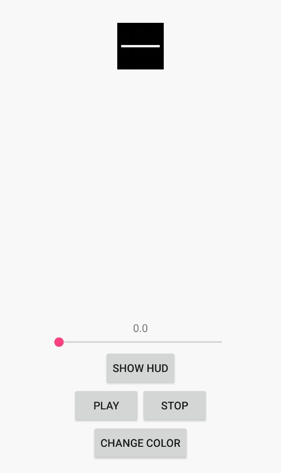

```
                ██╗███╗   ██╗██╗  ██╗ ██████╗ ███╗   ██╗ ██████╗ ████████╗███████╗                
                ██║████╗  ██║██║ ██╔╝██╔═══██╗████╗  ██║██╔═══██╗╚══██╔══╝██╔════╝
                ██║██╔██╗ ██║█████╔╝ ██║   ██║██╔██╗ ██║██║   ██║   ██║   █████╗  
                ██║██║╚██╗██║██╔═██╗ ██║   ██║██║╚██╗██║██║   ██║   ██║   ██╔══╝  
                ██║██║ ╚████║██║  ██╗╚██████╔╝██║ ╚████║╚██████╔╝   ██║   ███████╗
                ╚═╝╚═╝  ╚═══╝╚═╝  ╚═╝ ╚═════╝ ╚═╝  ╚═══╝ ╚═════╝    ╚═╝   ╚══════╝
```
<!--- ANSI Shadow -->

---

# DimoLogo

[](https://codebeat.co/projects/github-com-inkonote-dimologo-android-master)
[](https://codebeat.co/projects/github-com-inkonote-dimologo-android-master)
[](https://github.com/Inkonote/DimoLogo-Android/blob/master/LICENSE)



Download
---

Download the latest AAR from [Maven Central](https://search.maven.org/search?q=g:com.inkonote%20AND%20a:dimologo) via Gradle:

```gradle
implementation 'com.inkonote.dimologo:1.3.2'
```